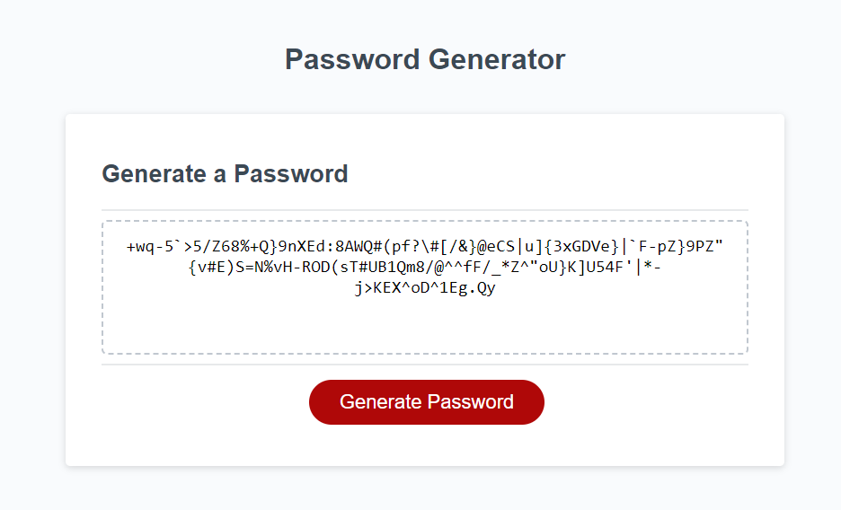

# Password-Generator

## Description

This application is to improve the starter code to satisfy the key generator requirements.
The length of the password can be set between 8 characters to 128 characters. A comfirmation would popup if enter incorrectly. User would be able to choose whether or not to include lowercase, uppercase, numeric or special characters in the password.

## Mock-UP

## Link
 https://houchenghao.github.io/Password-Generator/